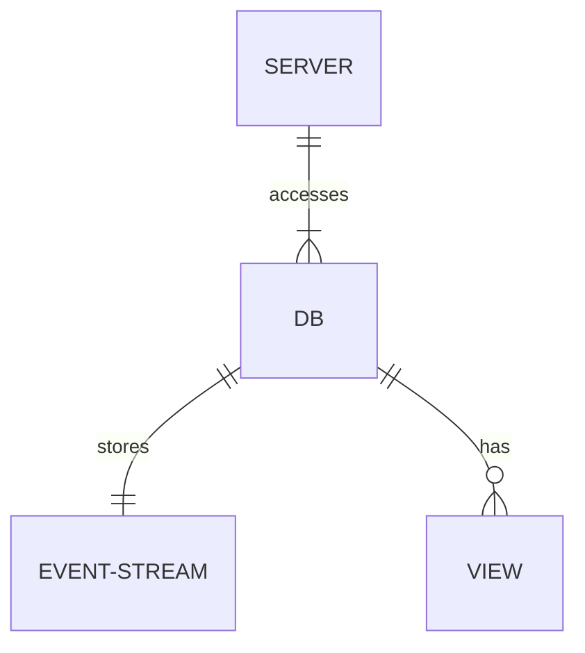
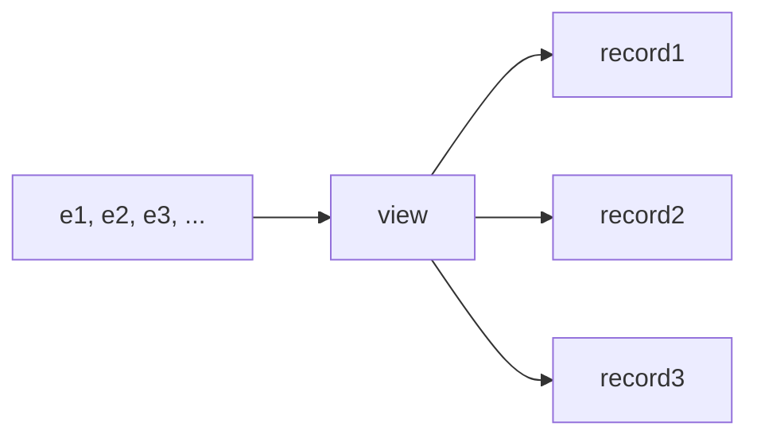

# Laterbase

## Product Specifications

### Overview

A fast distributed event store, designed for high write availability even under network partition. 

### Target Users

Users in industries where the domain is naturally eventful. (I'm primarily thinking of supply chain & logistics, but I'm sure there's others). Probably smaller outfits where the clumsiness of traditional ERPs is failing them. Logistics is an even more specific target, as they record more info "in the field" where network resiliency matters.

### Business Objectives:

- Improve supply chain and logistics operational efficiency.
- Function during network outages and in the field. 
- Optimize performance for event stream processing.
- Support multi-platform usage:

### Key Features:

- Backdating
- Multi region deployment without any loss of write availability
- Retroactive event writing for integration of existing and third-party data.
- User-defined schemas and aggregation functions.
- Focus on event sourcing and syncing.

## Functional Specifications



### Data Formats

#### Event Key

Each key needs to be both unique, and sortable.

Using ULIDs. Considered hybrid logical clocks but I don't need to capture any causality at this level.

Also considered UUIDv7s but the rust package situation was slightly more flakey. Should probably revisit this decision on the actual merits.

#### Event Value

Arbitrary bytes. It's up to the user to make sense of this.

#### Aggregate Key

Arbitrary bytes

### Aggregate Value

Arbitrary bytes

### HTTP Endpoints

#### Write one or more events

```
POST /{db-name}/e
```

#### Event changes feed

```
GET /{db-name}/e?vv={version-vector} 
```

Gets all the events the user *doesn't know about*.

This is not the same as getting all events that have happened since a certain time, since it's possible to backdate events. They are however returned in order of their hybrid logical clocks.

#### Query View

```
GET /{db-name}/{view-name}
```

### Views

I wish to utilise CouchDB style map-reduce views over events. 

These 'reduce' over an immutable log of events



## Design specifications

Laterbase should be a library - provide your own code for names of event roots, how to aggregate events, than it spins up a server.

One LMDB env per aggregate root. IE a single LMDB env has an event database as well as an aggregate one.

Modelling the entire database as a grow only set, using delta states.

#### Snapshots

Persist them on read. Reads are fast in LMDB, and we might as well insert on demand.

### Why don't you use Kafka?

TODO:

### Why LMDB?

To clarify, not 100% that LMDB should be the server side backing store. But I like it because...

- simple and does one thing. Less to learn/remember
- stable
- well documented
- easy to build
- fast reads

### Why not LMDB?

- Theoretically an LSM might be better for fast write speeds. TODO: actually measure this.
- Only one writer at a time

### Why Rust?

- zero overhead calling C libs (probably needed for embedded K/V stores)
- standard library is big and well documented
- healthy ecosystem
- fine-grained control of memory layout
- kind of functional, which is nice
- tooling is great

### Why not Zig?

- Not 1.0 yet
- No mature web micro-framework
- Less expressive than rust

### Why Axum?

- Backed by Tokio-rs, which has been around in rust for a long time
- Nicer API than Actix-web
- Makes sense to me!

## Roadmap

- ~~G-Set in rust (copy JS version, but make it mutable)~~
- ~~Delta state version. Make sure it passes tests~~
- ~~Sorted version using sequential IDs~~
- Add pre-compiled views at runtime
- "State machine" stye arbiraries that simulate multiple merges
- Simulate data loss of a node, and syncing again
- Test backdating
- Aggregate snapshot on read
- Sync views??
- Persistent storage using LMDB or similar
- Factor out in-memory storage engine, make a trait
- HTTP Server
- More tests with tokio-rs turmoil, or whatever works
- ???
- Profit

## References

- Almeida, Paulo Sérgio; Shoker, Ali; Baquero, Carlos (2016-03-04). "Delta State Replicated Data Types". Journal of Parallel and Distributed Computing. 111: 162–173
- Shapiro, Marc; Preguiça, Nuno; Baquero, Carlos; Zawirski, Marek (13 January 2011). "A Comprehensive Study of Convergent and Commutative Replicated Data Types". Rr-7506.
- Douglas Parker, Gerald Popek, Gerard Rudisin, Allen Stoughton, Bruce Walker, Evelyn Walton, Johanna Chow, David Edwards, Stephen Kiser, and Charles Kline. "Detection of mutual inconsistency in distributed systems.". Transactions on Software Engineering. 1983
- Carlos Baquero and Nuno Preguiça. "Why Logical Clocks are Easy". ACM Queue Volume 14, Issue 1. 2016.
