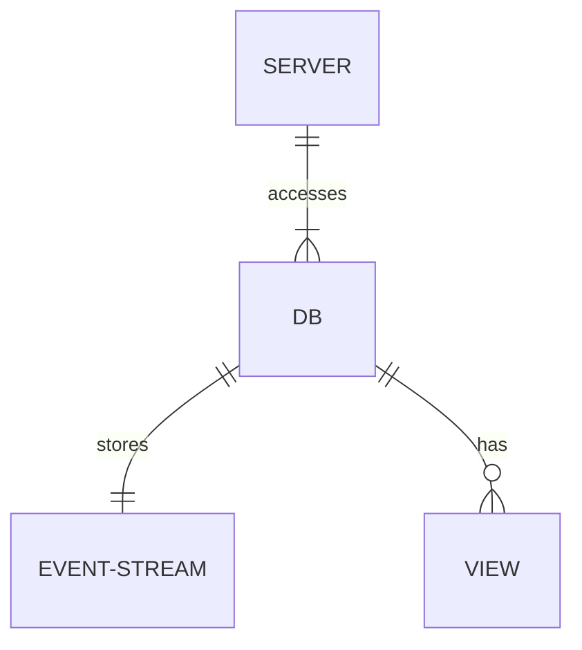

# Laterbase

## Product Specifications

### Overview

A fast, highly available event store. Designed to be the source of truth for event-driven industries like supply chain & logistics.

### Target Users

Users in industries where the domain is naturally eventful. (I'm primarily thinking of supply chain & logistics, but I'm sure there's others). Probably smaller outfits where the clumsiness of traditional ERPs is failing them. Logistics is probably an even more specific target, as they record more info "in the field" where network resiliency matters.

### Business Objectives

- Improve operational efficiency for supply chain and logistics industries.
- Ensure data resiliency during network outages through local event recording and syncing.
- Flexibility - users can define their own formats & schemas, that work with their existing systems. 
- Performance: purely focused on writing and aggregating event streams, nothing else. 
- Support multi-platform usage on servers, mobile phones, and web apps.

### Key Features

- Network outage resilience. Events are recorded locally and synced later when network conditions allow it, with no loss of data.
- Flexibility: multi-master, CRDT based system means events can be sent in any order, and servers can be on-device, on-premise or on the cloud.
- Back-dating: events can be written retroactively, allowing the integration of existing and third party data.
- Extensibility: Provide users with the ability to define their own schemas and aggregation functions to suit their particular needs.
- Uses high performance tools to ensure efficient processing
- Concentrates solely on event sourcing and syncing, keeping the system streamlined and purpose-driven.

## Functional Specifications




### Event Key 

Each key needs to be both unique, and sortable.

8 byte hybrid logical clock timestamp
8 bytes random padding

### Event Value format

4 bytes for the event type, 4 bytes for the event version.
The rest of the bytes are up to the user. Could be JSON, serialized data, whatever.

### Aggregate Key

User defined

### Aggregate Value

User defined

### HTTP Endpoints

#### Write one or more events
```
POST /{db-name}/e
```

#### Event changes feed
```
GET /{db-name}/e?vv={version-vector} 
```

Gets all the events the user *doesn't know about*.

This is not the same as getting all events that have happened since a certain time, since it's possible to backdate events. They are however returned in order of their hybrid logical clocks.

#### Query View
```
GET /{db-name}/{view-name}
```

### Read model

Maybe it's completely out of scope! Plus CQRS and all that.

Or maybe couchDB map reduce views over events. I feel like querying the actual event streams is going to be more useful when dealing with naturally eventful domains.

## Design specifications

Laterbase should be a library - provide your own code for names of event roots, how to aggregate events, than it spins up a server.

One LMDB env per aggregate root. IE a single LMDB env ha 


Modelling the entire database as a grow only set, using delta states.
Each aggregate would be a different database in LMDB. Or would it be an env? LMDB only has one writer per env.

#### Snapshots

Persist them on read. Reads are fast in LMDB, and we might as well insert on demand.

### Why LMDB?

To clarify, not 100% that LMDB should be the server side backing store. But I like it because...

- simple and does one thing. Less to learn/remember
- stable
- well documented
- easy to build
- fast reads

### Why not LMDB?

- Theoretically an LSM might be better for fast write speeds. TODO: actually measure this.
- Only one writer at a time

### Why Rust?

- zero overhead calling C libs (probably needed for embedded K/V stores)
- standard library is big and well documented
- healthy ecosystem
- fine-grained control of memory layout
- kind of functional, which is nice
- tooling is great

### Why not Zig?

- Not 1.0 yet
- No mature web microframework
- Less expressive than rust

### Why Axum?

- Backed by Tokio-rs, which has been around in rust for a long time
- Nicer API than Actix-web
- Makes sense to me!

### Record format

#### Event

```
[type, version, data ...]
```

#### Aggregate

Custom

## Roadmap

- G-Set in rust (copy JS version, but make it mutable)
- Delta state version. Make sure it passes tests.
- Sorted version using hybrid logical clocks
- Test backdating
- Basic aggregates
- Aggregate snapshot on read
- Factor out in-memory storage engine, make a trait
- HTTP Server
- More tests with tokio-rs turmoil, or whatever works
- Persistent storage using LMDB or similar
- ???
- Profit

## References

- Almeida, Paulo Sérgio; Shoker, Ali; Baquero, Carlos (2016-03-04). "Delta State Replicated Data Types". Journal of Parallel and Distributed Computing. 111: 162–173
- Shapiro, Marc; Preguiça, Nuno; Baquero, Carlos; Zawirski, Marek (13 January 2011). "A Comprehensive Study of Convergent and Commutative Replicated Data Types". Rr-7506.
- Douglas Parker, Gerald Popek, Gerard Rudisin, Allen Stoughton, Bruce Walker, Evelyn Walton, Johanna Chow, David Edwards, Stephen Kiser, and Charles Kline. "Detection of mutual inconsistency in distributed systems.". Transactions on Software Engineering. 1983
- Carlos Baquero and Nuno Preguiça. "Why Logical Clocks are Easy". ACM Queue Volume 14, Issue 1. 2016.
