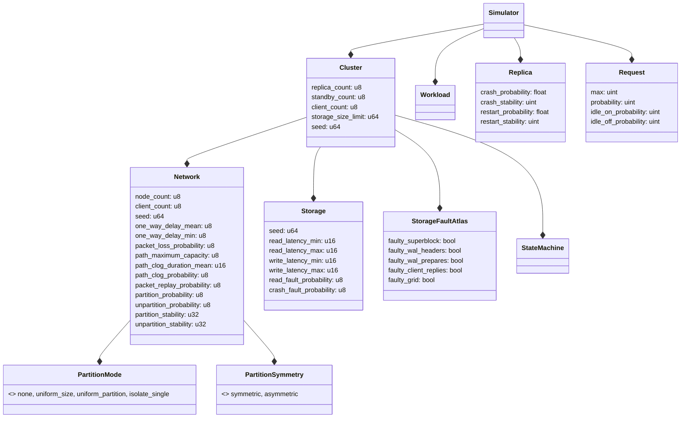
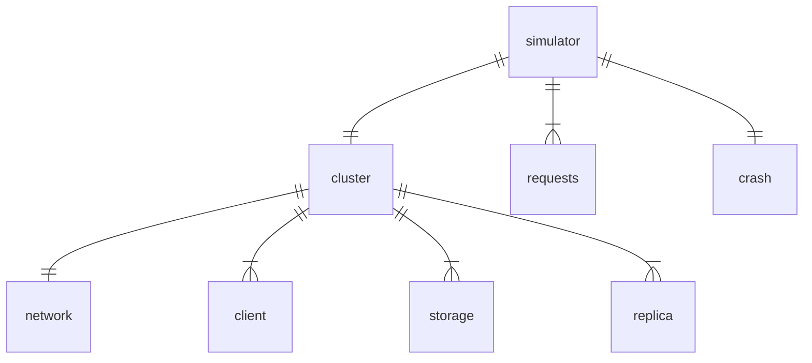

# Determinstic Simulation Testing

## TigerBeetle Simulator (VOPR)

commit cbc390cdf94973ade9a6a287b4ea07c8a1c51bc0 

### Seed

- Seed itself is randomly generated or passed to commandline args (presumably to facilitate replays).
- Systems each have their own seed - a random number from the top level seeded PRNG. I think this is so each subsystem can be replayed independently.

### Main Function

- Determines how many replicas, standbys and clients there will be.

### Options

#### Tick

#### What is being tested?

#### What is being simulated?

- Number of replicas

- The root thing being simulated is the cluster

- Network

- Storage

- State Machinae

- number of clients

- Crash/Restart probability and stability, max requests

- request idle??

- Time

- Liveness. what is that part testing?

- Do requests get corrupted?

#### Glossary

- Nodes = Replica | Standby

- Standby - node currently not participating in the replication ??

- Replica

- One *primary* replica receives writes, the other *backup* replicas do not.

- View: conceptual state snapshots of the whole system

- Storage Fault Atlas 

- `.in_flight_max` in-flight of what?

- Partition Symmetry

- Core: "strongly-connected component of replicas containing a view change quorum"

- Core vs Quorum

- Sequencer

### "Testing Distributed Systems w/ Deterministic Simulation" by Will Wilson

https://www.youtube.com/watch?v=4fFDFbi3toc

- Bugs often not repeatable due to transient network conditions. Packets could be re-arranged or dropped.

- "The messy dirty universe has intruded on our beautiful pristine land of pure functions" - LOL

- Network: Source of entropy & randomness that *you do not control*. Also applies to threads, disks etc.

- "We didn't write a database. We started by writing a simulation of a database. A totally deterministic simulation. And then... we were like 'OK now we can write a database, which is just that but talking to networks and talking to disks for real'"

- For a couple of years foundation DB had no DB, just a simulation.

- You need 'single threaded pseudo-concurrency' - this feels kind of like an actor model crossed with a game loop. But only one real thread or process allowed.

- Need to simulate external sources of randomness. Disks that fail, unreliable networks etc. I do wonder if there's tools out there that do this...

- Simulation needs to be deterministic - ie can't read from actual clock, need to fake it, all rng accesses need to be seeded, etc.

- They made heavy use of 'callbacks' (horrible in C++).

- They **do** use actor model concurrency in the simulation.

- They make use of futures in the simulation. TODO: how are they different from oromises again?

- Their actual C++ implementation is horrifying. Ignoring it for my sanity.

- They already had difference interfaces for network, connections, and async file handling. Their simulation was just another implementation of it. Classic hexagonal architecture!

- They utilise 'test files'. Goals of the system wants to achieve, and simulated obstacles that will stop it achieving those goals.

- They have an invariant they check at the end, ie the 'Ring Test'. K,V pairs, each V points to the next V (V1 -> K2, V2 -> K3). Write a bunch of mutations of those keys and values, and check the ring holds at the end.

- **Random clogging** - prevent network connections sending or receiving packets.

- **Swizzle** - stop network connections on a rolling basis, then bring them back up in reverse order. 

- Kill 7/10 machines, make sure 3 are on at any given time.

- Machines have 1% chance of sending an error.

- Swap storages of two machines, so now a node has a completely different set of data but the same IP address.

- Hardware often fails together, not completely randomly. Try and simulate this ('Hurst exponent').
