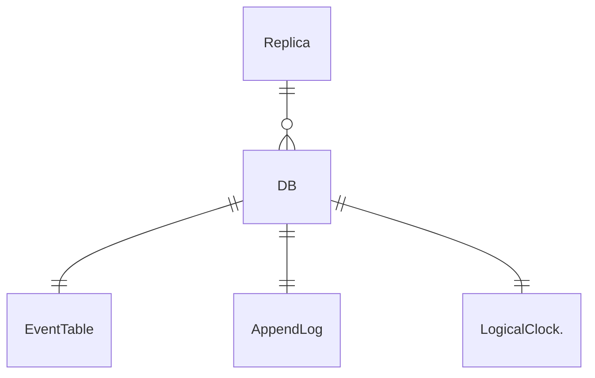
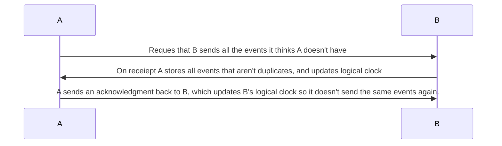

## Taxonomy

### Event Store

Designed to store representations of real world events, as the source of truth of a data system.
### Multi-Master

There is no master, leader, primary, otherwise 'special' node in the cluster. Everything can receive writes without waiting for any other nodes, and merge later.
### Append-Only

Events can only be added, never removed.
### Bi-Temporal

Events can be queried by Transaction Time (when they written to a DB) and Valid Time (when they happened in the real world).

## High level architecture

## Data Structures

First off, let's sketch out what I need to be able to do:
- Having an append only list of Event IDs - ordered by when they were added to that node. this helps with syncing.
- Be able to quickly look up events by their unique ID.
- Range scans by transaction time.
- Range scans by valid time.
### Replica
The entire replica constitutes a [CRDT](https://crdt.tech/) - specifically, a grow-only map. 
### IDs 
IDs need to be:
- **Globally Unique**: Any laterbase should be able to sync with any other. This implies a 16 byte key with a lot of randomness.
- **Sortable**: Ordered key value stores are the 'lowest common denominator' of storage engines - let's try and match these semantics. This implies the IDs are prefixed with some kind of physical timestamp.

To this end I have decided on a ULID, with the timestamp section encoding valid time.

### Timestamps

AFAICT there are four different kinds of time in the system.

|             | Logical                              | Physical                |
| ----------- | ------------------------------------ | ------------------------|
| **Transaction** | Event A was recorded before Event B  | When event was recorded |
| **Valid**       | Event A happened before event B      | When event happened     |

Can we combine logical and physical timestamps and get that down to 2?

### Logical Clock

Each replica has an associated logical clock. It's based on a  [version vector](https://en.wikipedia.org/wiki/Version_vector), but it stores sent and received events separately. This seems to let me just sent a single int across the network, and not the whole clock. TODO: see if any Portuguese logical clock wizard will give me any feedback.

## Sync Protocol

This is my take on a delta-state CRDT. These messages are idempotent, and if they are not responded to things will still keep trucking (albeit more slowly - not getting an ack means more events will be sent next sync).

## Hybrid Logical Clocks: Reconsidered

- Can query events in relation to physical time

- Is always close to an NTP clock (standard 64 bit unix timestamp??)

- Causality: e hb f => hlc.e < hlc.f, lc.e = lc.f => e || f, e hb f <=> vc.e < vc.f

- Does not require a server-client architecture: which is good because I don't have one!

- Works for a peer to peer node setup.

- Monotonic, unlike NTP

- Can "identify consistent snapshots in distributed databases". Unique indentifier??

- "The goal of HLC is to provide one-way causality detection similar to that provided by LC, while maintaining the clock value to be always close to the physical/NTP clock."

Are they unique? I don't think so.
What problem would they solve for me?

## Design specifications

Laterbase should be a library - provide your own code for names of event roots, how to aggregate events, than it spins up a server.

One LMDB env per aggregate root. IE a single LMDB env has an event database as well as an aggregate one.

Modelling the entire database as a grow only set, using delta states.

## FAQ

### Why make this when Kafka exists?

- Has clients and servers - I want to do something multi-master.

### Why plan on using LMDB as a backing store?

Not 100% that LMDB should be the server side backing store. But I like it because...

- simple and does one thing. Less to learn/remember
- stable
- well documented
- easy to build
- fast reads

### Why not LMDB?

- Theoretically an LSM tree might be better for fast write speeds. TODO: actually measure this.
- Only one writer at a time

### Languages

Currently in F#, though I did start this project in rust.

#### Why F#?

- expressive enough and has a big enough ecosystem that prototyping is easy
- fast enough that I can avoid a systems lang re-write for a long time (maybe indefinitely?)

#### Why Rust?

- zero overhead calling C libs (probably needed for embedded K/V stores)
- standard library is big and well documented
- healthy ecosystem
- fine-grained control of memory layout
- kind of functional, which is nice
- tooling is great

#### Why not Rust?

Complexity. Rust has a lot of great features but the interaction between them all becomes a nightmare. I was spending all my time solving Rust issues and no time solving Zig issues.

#### Why Zig?

- Would not be the only DB that uses it!
- Most productive I've ever been in a systems lang.
- Very ergonomic for dealing with bits and bytes.
- Relatively simple.

#### Why not Zig?

- Not 1.0 yet
- No mature web micro-framework (TODO: Zap?)
- No property based testing.
- Not that expressive.
- Unused variables when debugging & testing is *fine* and I will not be shamed into thinking otherwise.

## Papers

The following have been very helpful to me.

- Almeida, Paulo Sérgio; Shoker, Ali; Baquero, Carlos (2016-03-04). "Delta State Replicated Data Types". Journal of Parallel and Distributed Computing. 111: 162–173
- Shapiro, Marc; Preguiça, Nuno; Baquero, Carlos; Zawirski, Marek (13 January 2011). "A Comprehensive Study of Convergent and Commutative Replicated Data Types". Rr-7506.
- Douglas Parker, Gerald Popek, Gerard Rudisin, Allen Stoughton, Bruce Walker, Evelyn Walton, Johanna Chow, David Edwards, Stephen Kiser, and Charles Kline. "Detection of mutual inconsistency in distributed systems.". Transactions on Software Engineering. 1983
- Carlos Baquero and Nuno Preguiça. "Why Logical Clocks are Easy". ACM Queue Volume 14, Issue 1. 2016.