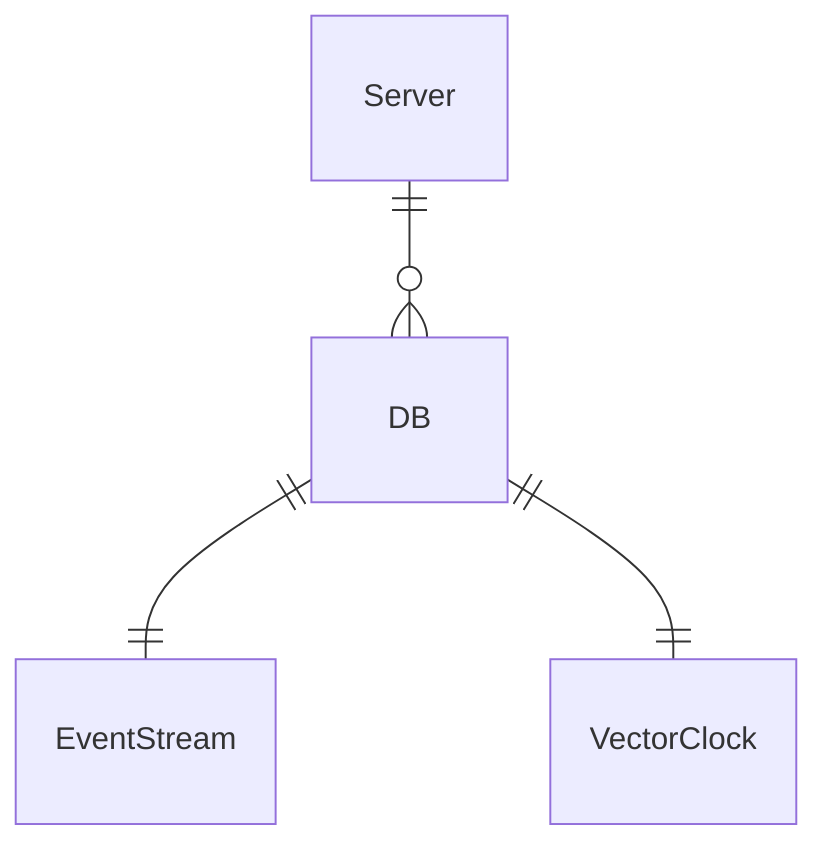
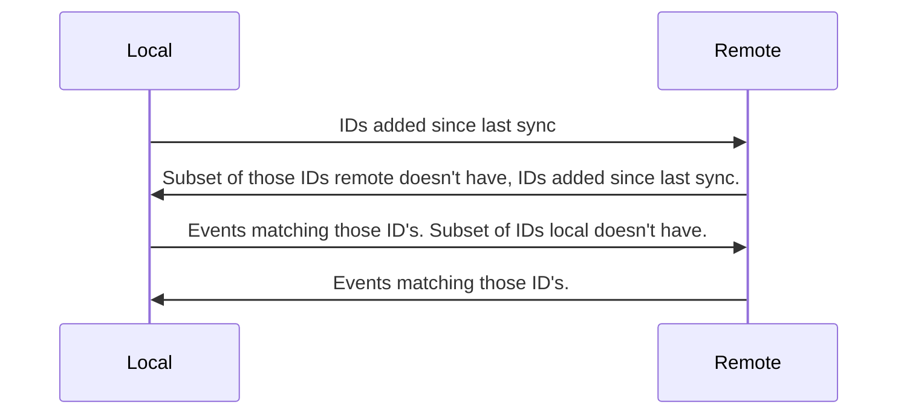

## Taxonomy

### Event Store

Designed to store representations of real world events, as the source of truth of a data system.
### Multi-Master

There is no master, leader, primary, otherwise 'special' node in the cluster. Everything can receive writes without waiting for any other nodes, and merge later.
### Append-Only

Events can only be added, never removed.
### Bi-Temporal

Events can be queried by Transaction Time (when they written to a DB) and Valid Time (when they happened in the real world).

|             | Logical                              | Physical                |
| ----------- | ------------------------------------ | ------------------------|
| **Transaction** | Event A was recorded before Event B  | When event was recorded |
| **Valid**       | Event A happened before event B      | When event happened     |


## High level architecture



## Data Structures

First off, let's sketch out what I need to be able to do:
- Having an append only list of Event IDs - ordered by when they were added to that node. this helps with syncing.
- Be able to quickly look up events by their unique ID.
- Range scans by transaction time.
- Range scans by valid time.
### Event Stream
The entire event stream constitutes a [CRDT](https://crdt.tech/) - specifically, a grow-only map. 
### Keys
I've had some thoughts on this. 

Keys need to be:
- globally unique. Any laterbase should be able to sync with any other (within reason!).
- Sortable. Ordered key value stores are the 'lowest common denominator' of storage engines to build this on.
It'd be nice if they captured one of
- Valid Time
- Transaction Time
- Logical Time

The Keys are [ULID](https://github.com/ulid/spec) and the values are arbitrary bytes.

This maps well to ordered key value stores, like LMDB or IndexedDB.

Each event stream has an associated [vector clock](https://en.wikipedia.org/wiki/Vector_clock). This is used to keep track of other replicas it has synced to.

## Sync Protocol

This is my take on a delta-state CRDT.

TODO: considering abandoning this req/res handshake scheme into something more fire-and-forget. More pure message passing; just fire stuff to a random selection of neighbours and let the gossip spread.



## Hybrid Logical Clocks: Reconsidered

- Can query events in relation to physical time

- Is always close to an NTP clock (standard 64 bit unix timestamp??)

- Causality: e hb f => hlc.e < hlc.f, lc.e = lc.f => e || f, e hb f <=> vc.e < vc.f

- Does not require a server-client architecture: which is good because I don't have one!

- Works for a peer to peer node setup.

- Monotonic, unlike NTP

- Can "identify consistent snapshots in distributed databases". Unique indentifier??

- "The goal of HLC is to provide one-way causality detection similar to that provided by LC, while maintaining the clock value to be always close to the physical/NTP clock."

Are they unique? I don't think so.
What problem would they solve for me?

### HTTP Endpoints

#### Write one or more events

```
POST /db/{db-name}/e
```

#### Event changes feed

```
GET /db/{db-name}/e?lc={logical_clock}
```

Gets all the events a node *doesn't know about*.

This is not the same as getting all events that have happened since a certain time, since it's possible to backdate events. They are however returned in order of their hybrid logical clocks.

#### Bulk read arbitrary events

GET /db/{db-name}/e?keys={key1, key2}

Since the keys are ulids, keys are in crockfords base32 text format.

#### Query View

```
GET /{db-name}/{view-name}
```

### Views

## Design specifications

Laterbase should be a library - provide your own code for names of event roots, how to aggregate events, than it spins up a server.

One LMDB env per aggregate root. IE a single LMDB env has an event database as well as an aggregate one.

Modelling the entire database as a grow only set, using delta states.

### FAQ

#### Why not Kafka?

- Has clients and servers - I want to do something multi-master.

- Streams events are not designed for querying directly, that's what views are for.

#### Why LMDB?

Not 100% that LMDB should be the server side backing store. But I like it because...

- simple and does one thing. Less to learn/remember
- stable
- well documented
- easy to build
- fast reads

#### Why not LMDB?

- Theoretically an LSM might be better for fast write speeds. TODO: actually measure this.
- Only one writer at a time

#### Why Rust?

- zero overhead calling C libs (probably needed for embedded K/V stores)
- standard library is big and well documented
- healthy ecosystem
- fine-grained control of memory layout
- kind of functional, which is nice
- tooling is great

#### Why not Zig?

- Not 1.0 yet
- No mature web micro-framework
- Less expressive than rust
- Unused variables when debugging & testing is *fine* and I will not be shamed into thinking otherwise.

#### Why Axum?

- Backed by Tokio-rs, which has been around in rust for a long time
- Nicer API than Actix-web
- Makes sense to me!

## References

- Almeida, Paulo Sérgio; Shoker, Ali; Baquero, Carlos (2016-03-04). "Delta State Replicated Data Types". Journal of Parallel and Distributed Computing. 111: 162–173
- Shapiro, Marc; Preguiça, Nuno; Baquero, Carlos; Zawirski, Marek (13 January 2011). "A Comprehensive Study of Convergent and Commutative Replicated Data Types". Rr-7506.
- Douglas Parker, Gerald Popek, Gerard Rudisin, Allen Stoughton, Bruce Walker, Evelyn Walton, Johanna Chow, David Edwards, Stephen Kiser, and Charles Kline. "Detection of mutual inconsistency in distributed systems.". Transactions on Software Engineering. 1983
- Carlos Baquero and Nuno Preguiça. "Why Logical Clocks are Easy". ACM Queue Volume 14, Issue 1. 2016.
